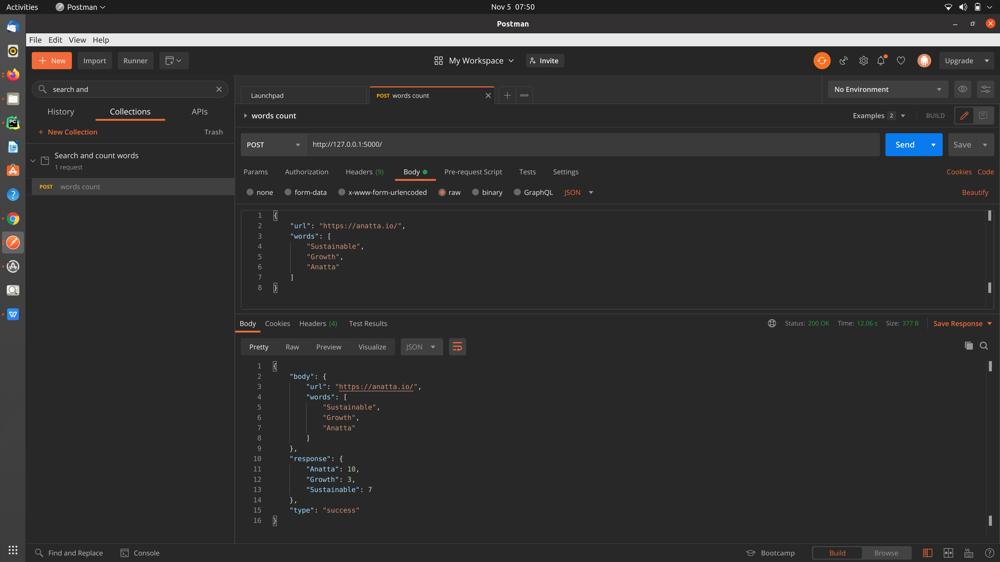

```
first install all packages mentioned in requirements.txt
run "scraping_and_count.py" file or run "python scraping_and_count.py" in terminal.
```



```
API:-->
        POST: http://127.0.0.1:5000/
        request_body:
            {
                "url": "https://anatta.io/",
                "words": [
                    "Sustainable",
                    "Growth",
                    "Anatta"
                ]
            }
        
        response:
            {
                "body": {
                    "url": "https://anatta.io/",
                    "words": [
                        "Sustainable",
                        "Growth",
                        "Anatta"
                    ]
                },
                "response": {
                    "Anatta": 10,
                    "Growth": 3,
                    "Sustainable": 7
                },
                "type": "success"
            }
```


Here if we want to run like `node my-script.js --url=https://anatta.io --words=Sustainable,Growth,Anatta`.

then run below script: 
```
python pass_vari.py --url=https://anatta.io --words=Sustainable,Growth,Anatta
```
response:

```
{'Sustainable': 7, 'Growth': 3, 'Anatta': 10}
```
